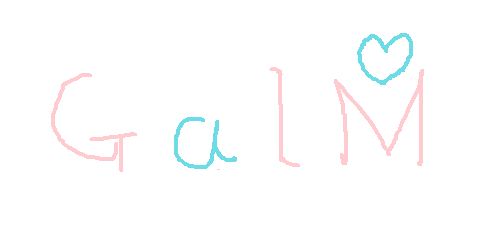

# GalM

[](https://github.com/awrznc/GalM/actions)
[](https://crates.io/crates/galm)

GalM is pattern matching library.



Inspired by Galmoji.

# Quick start

Put the following in your project's Cargo.toml file:

```toml
[dependencies]
galm = "0.0.1"
```

And overwrite in your project's main.rs file:

```rust
fn main() {
    let galm: galm::Database = galm::new();
    let distance: u8 = galm.get_distance("王", "玉");

    assert_eq!(distance, 30);
}
```

# Example

Print the most similar string from the strings separated by commas.

```bash
# build
cargo build --example galm --release

# use
./target/release/examples/galm "王様レストラン" -d "皇様レストラン,玉様レストラン,大様レストラン"
# => 玉様レストラン
```
